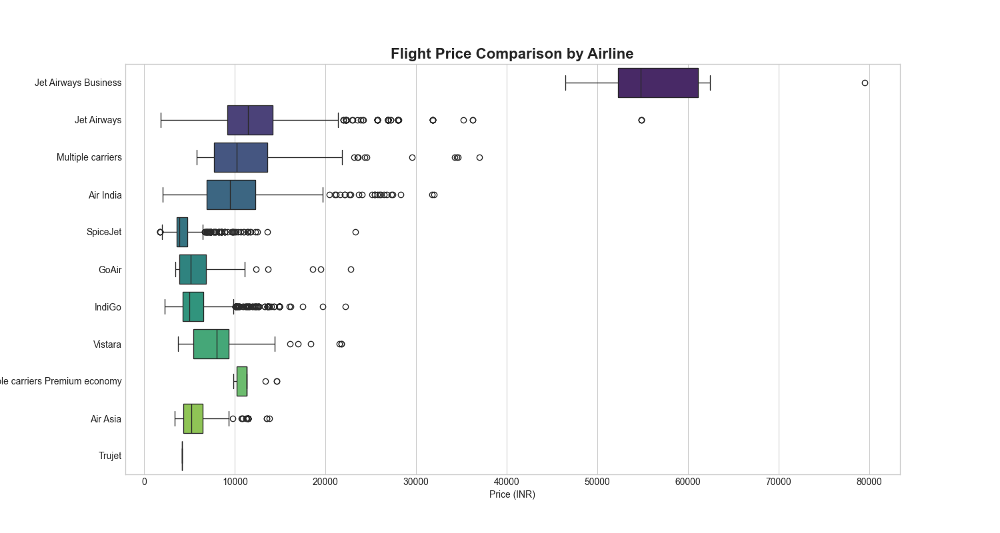
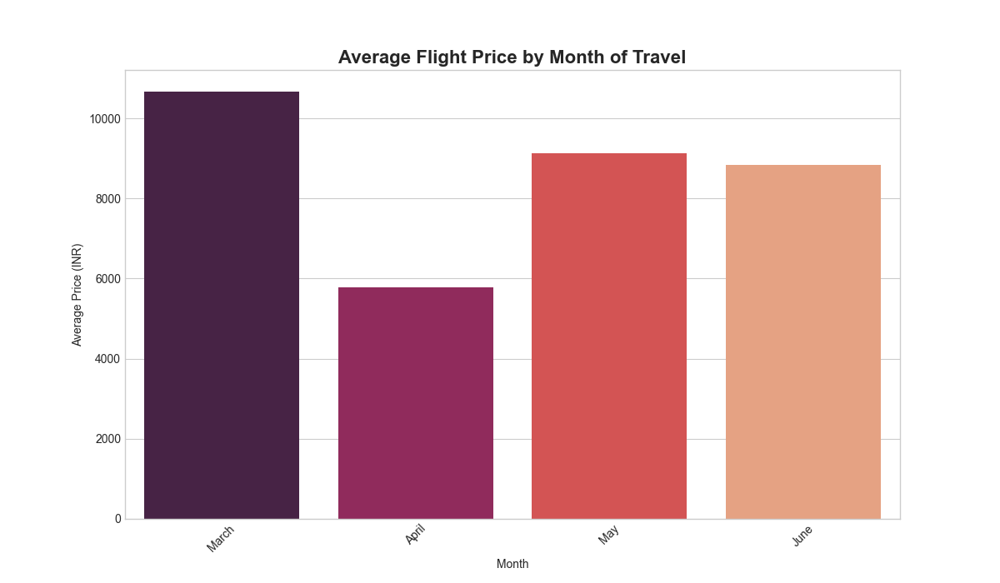
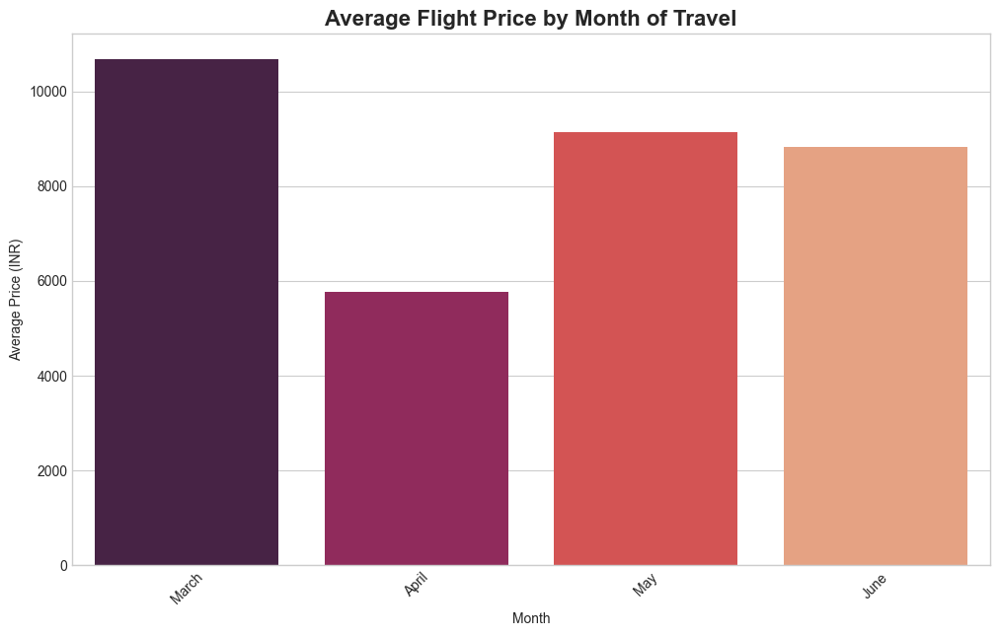
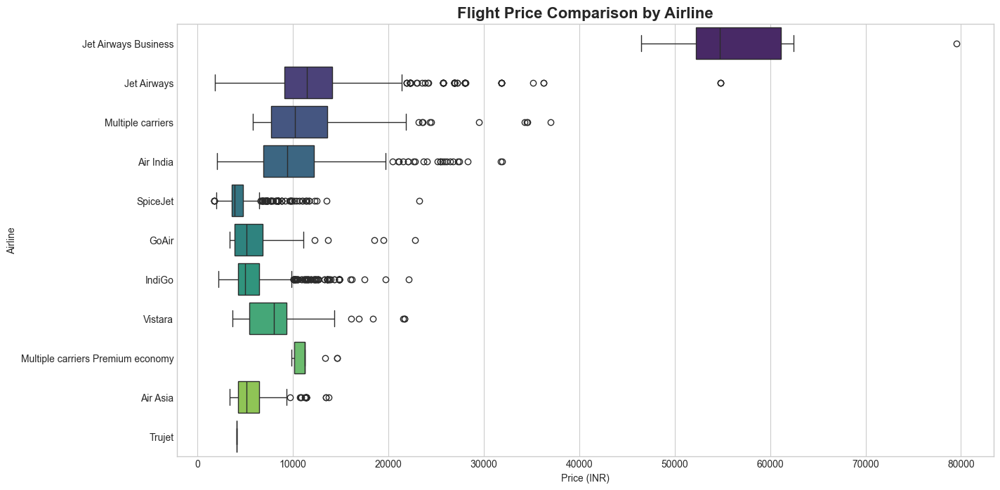

# Indian Domestic Flight Price Analysis

This project performs an end-to-end analysis of flight ticket prices for major Indian domestic routes. The goal is to uncover patterns that determine flight costs, such as the airline, time of booking, and month of travel. The entire analysis is conducted in a Jupyter Notebook, culminating in an auto-generated summary dashboard in Excel.

---

## 🎯 Project Goal

As a data analyst for a travel comparison website, the objective is to answer key questions for consumers:
1.  Which airlines are consistently the most and least expensive?
2.  How does flight price vary based on the month of travel?
3.  What are the most expensive routes?
4.  Provide actionable insights to help travelers save money.

---

## 🛠️ Tech Stack

* **Primary Tool:** `Jupyter Notebook`
* **Data Manipulation & ETL:** Python (`pandas`)
* **Database:** `SQLite` (via `SQLAlchemy`)
* **Data Visualization:** Python (`matplotlib`, `seaborn`)
* **Automated Dashboarding:** Python (`xlsxwriter`) & `Microsoft Excel`

---

## 📊 Key Insights & Visualizations

The analysis reveals significant price variations among airlines and identifies seasonal travel trends. For instance, some budget airlines are consistently cheaper, while prices spike during peak holiday months like June and May.

| Airline Price Comparison | Average Price by Month |
| :---: | :---: |
|  |  |

### Automated Excel Dashboard

An executive summary dashboard is automatically generated using Python. It highlights the key findings, such as the most affordable airlines and the most expensive travel routes.

*(You will need to take a screenshot of your generated dashboard and replace this link.)*

---

## 🚀 How to Run This Project

1.  **Clone the repository.**
2.  **Download the Dataset:**
    * Go to the [Flight Price Prediction dataset on Kaggle](https://www.kaggle.com/datasets/nikhilmittal/flight-fare-prediction-mh).
    * Download the `.zip` file and extract `Data_Train.xlsx`.
    * Create a `source_data` folder in your project directory and place `Data_Train.xlsx` inside it.
3.  **Install libraries:** `pip install -r requirements.txt` (Note: you may also need `pip install openpyxl` to read `.xlsx` files).
4.  **Launch Jupyter Notebook:** `jupyter notebook`
5.  **Run the Notebook:** Open `Flight_Analysis_Notebook.ipynb` and run the cells sequentially.

## VISUALIZATIONS

### AVERAGE FLIGHT PRICE

### FLIGHT COMPARSION 
